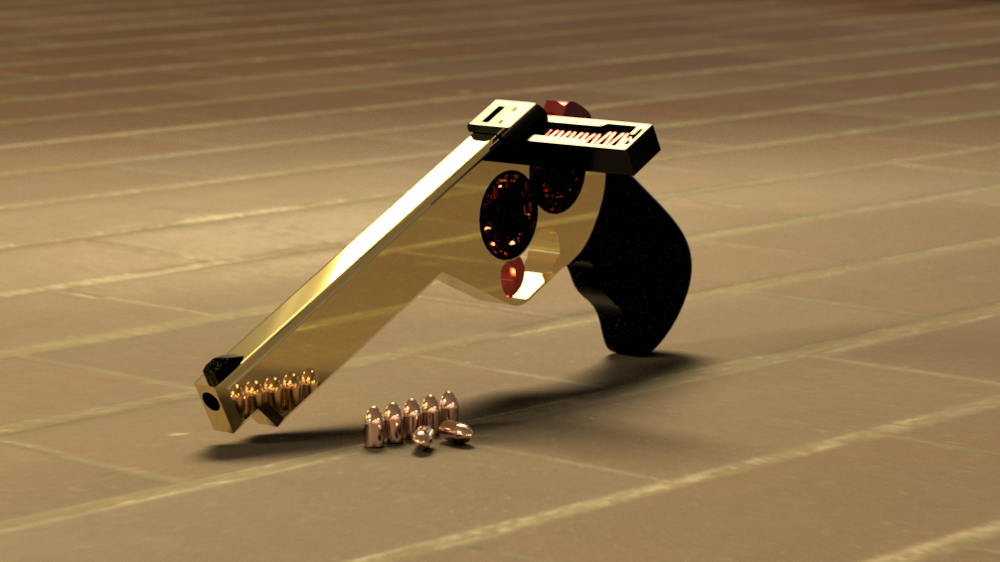
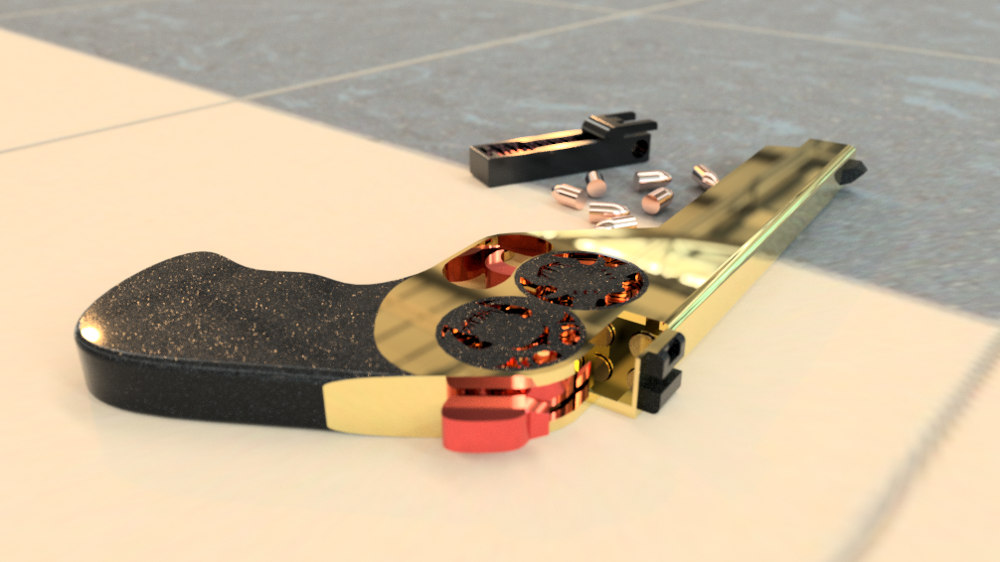
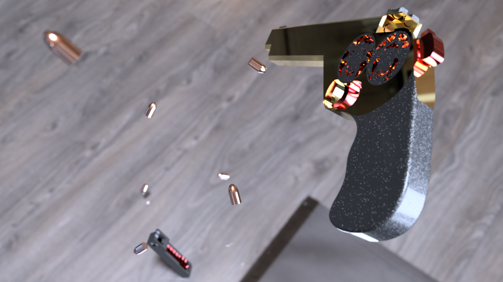
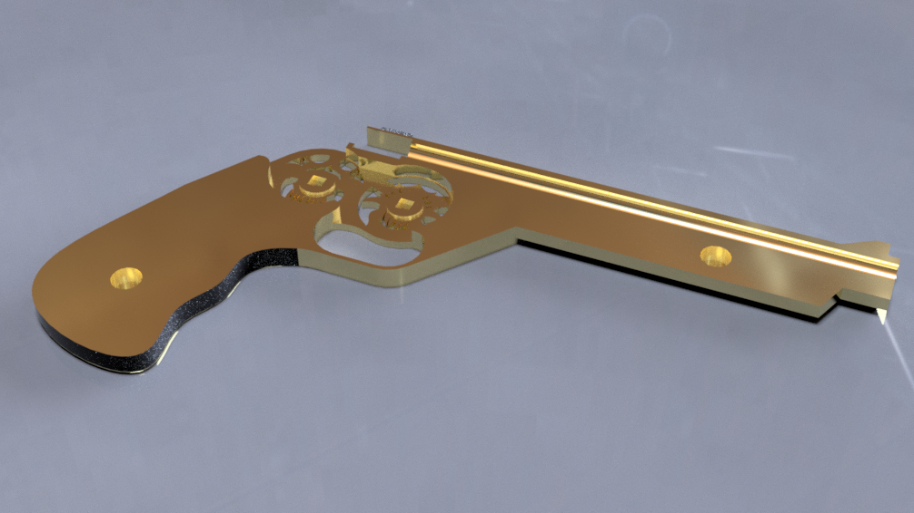
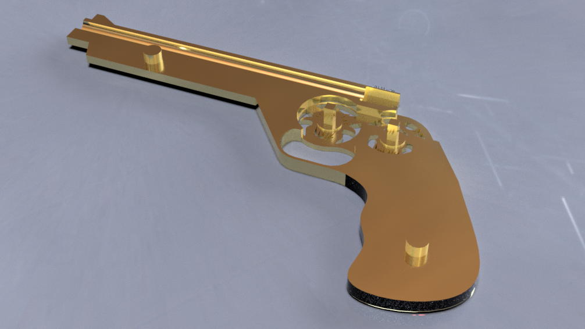
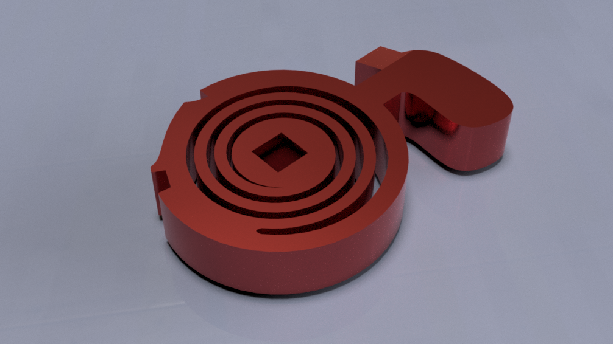
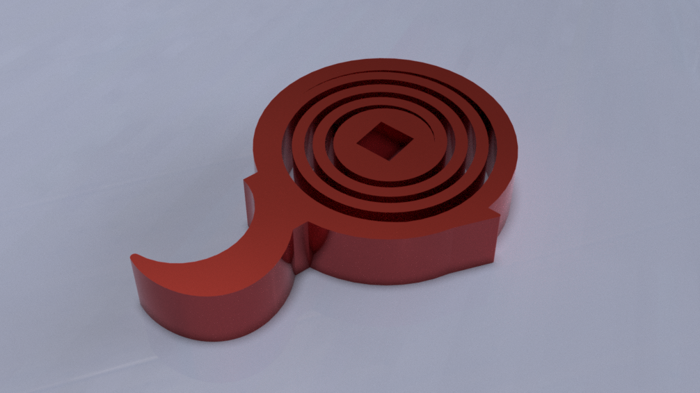
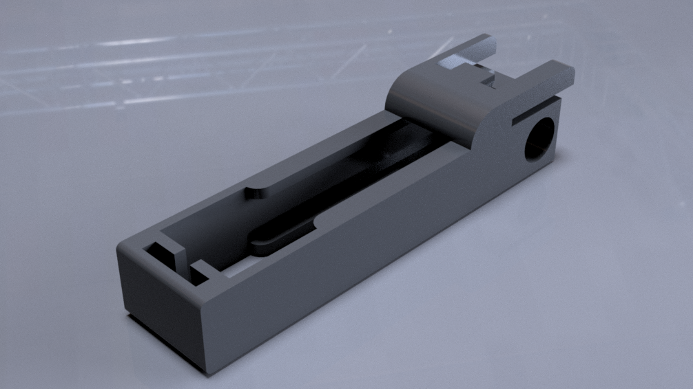
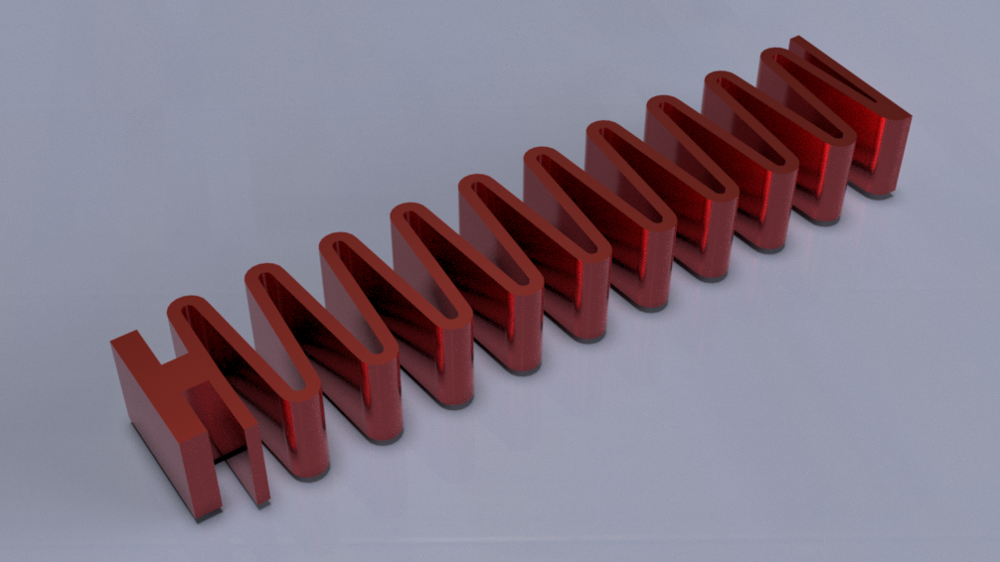
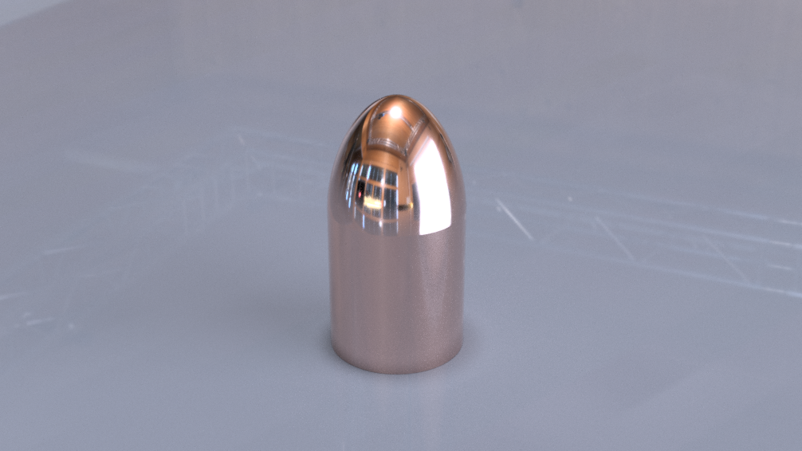

# 3D Printed Mechanical Blaster

A fully 3D-printable, **hammer-fired** mechanical toy blaster built around snap-fit assembly, **three entirely 3D-printed springs**, and a detachable, spring-fed dart magazine. No metal hardware, no rubber bands — every functional part, including all springs, comes off the print bed.

## Project Description

This project is a hand-held, hammer-fired spring blaster that launches 3D-printed darts from a removable, spring-fed magazine. Energy is stored by winding a printed **spiral hammer spring**; pulling the trigger releases the hammer, which strikes a dart and fires it down the barrel. A printed **trigger-return spring** resets the trigger, and a printed **zig-zag magazine spring** feeds the next dart automatically.

What makes it notable: the entire mechanism — frame, barrel, hammer, trigger, magazine, darts, and **all three springs** — is 3D printed. The only thing between a spool of filament and a working blaster is print time and assembly.

The goal was to design a product that:
- **Serves a purpose** — IT'S FUN! It actually fires darts and reloads from a magazine, while doubling as a tactile fidget object.
- **Makes sense mechanically** — a wound spiral spring stores the firing energy; a sear/trigger releases it; a separate follower spring handles feeding.
- **Stays printable** — split into bed-friendly, snap-fit components with tuned tolerances so it prints with minimal supports.

## How It Works

The blaster is split into an **upper** (barrel / slide) and a **lower** (frame, grip, hammer & trigger housing), plus a **detachable magazine**.

1. **Load the magazine.** Pull the follower down with your thumb and drop darts in through the skeletonized magazine's side feed-lips, against the zig-zag **magazine spring**, which keeps constant pressure so a fresh dart is always presented in line with the barrel.
2. **Insert the magazine.** It slides into the frame and a snap joint engages the upper case, locking it in place so it stays seated during firing until it is deliberately removed.
3. **Cock the hammer.** Cocking winds the spiral **hammer spring**, storing firing energy; a sear catches and holds the hammer.
4. **Fire.** Pulling the trigger releases the sear — the hammer snaps forward under the unwinding hammer spring and strikes the dart, launching it down the upper's barrel. The **trigger spring** returns the trigger to its resting position.
5. **Feed.** With the dart gone, the magazine spring advances the next dart into the barrel line. Because the magazine sits in-line as a *shoot-through breech*, there's no separate chambering step — it's ready to cock and fire again.

### Why it works
- **Spiral (clock-type) torsion springs** for the hammer and trigger store rotational energy compactly and spread the load along the whole coil — important for printed plastic, which takes a permanent set if a single section is over-stressed. Winding distributes strain so the spring survives repeated cycling.
- The **zig-zag magazine spring** is a linear, low-force accordion: long travel in a compact part, with gentle, consistent follower pressure that advances a dart without binding the feed.
- The **upper/lower split** isolates the moving hammer and barrel from the static frame for a clean, repeatable action and an easier print.

## My Contribution & Design Philosophy

**The entire case — both the upper and the lower — is my own original creation, reimagined from the ground up.** The form factor, grip ergonomics, barrel layout, and the gold/black aesthetic are all mine; the case is not derived from any existing design.

What I drew from the two references below are the **functional building blocks**, which I then re-engineered so they could work *together* in one product:

- From the [**3D Printed Spring Blaster**](https://youtu.be/xOeDvl-vA04): the concept of a printed-spring-powered firing action, which I reworked into a wound spiral **hammer spring** plus a printed **trigger-return spring**.
- From the [**3D Printed Spring Gun with working Magazine**](https://youtu.be/UC8Zp1ZFvpY): the removable, spring-fed **magazine** and its zig-zag follower spring.

So the heavily-inspired elements are limited to the **three springs and the magazine** — everything that houses and connects them is original. Making a hammer-driven action and an auto-feeding magazine coexist meant rethinking how the hammer, sear, feed path, and three springs interact, since each reference solved only one half of the problem.

A detail I'm particularly proud of: **the magazine locks in place via a snap joint that engages the upper case** when inserted. It stays firmly seated during firing and only releases when deliberately removed — no wobble and no metal catch, fully printed.

## Design Journey

The final design is the result of real iteration. Two decisions shaped it more than any other: **how darts feed**, and **how the magazine stays locked**.

### Feeding system: from gravity hopper to side-mounted magazine

The first question was how to get a dart into the chamber. Several approaches were considered:

- **Vertical gravity hopper** — ruled out early. Hoppers are notoriously unreliable: tilt the blaster sideways or let darts clump together and gravity stops feeding, causing dry-fires. Worse, without constant pressure a dart can fall into the chamber half-seated just as the hammer swings forward, crushing it and jamming the action. A bulky top-mounted container would also have hidden the exposed spiral torsion spring that gives the blaster its mechanical character.
- **Bottom-feeding magazine** — rejected because it needs a complex transfer / lifter bar to raise rounds up to the barrel.
- **Horizontal feeding** — the winner. The choice came down to a sliding "harmonica" block versus a side-mounted ("Sten-style") magazine, and I went with the **side-mounted magazine**. It was worth troubleshooting the spring tension in exchange for the cool factor and the mechanical simplicity it unlocked: the swinging hammer doubles as **both the firing pin and the block that holds the next dart back**.

**The breakthrough** was treating the magazine as a physical extension of the barrel — a "shoot-through" / nested-breech layout. The dart fires straight through the magazine's feed position, which completely eliminates the need for a separate chambering mechanism.

**A course correction:** I first planned to reload darts backward through the front barrel hole of the magazine, but the geometry won't allow pushing darts in against the follower spring's pressure. The fix was a **skeletonized magazine** — open sides let you pull the follower down with your thumb and drop darts straight in through the side feed-lips.

### Magazine catch: from flex-latch to snap joint

With the magazine on the side, it had to stay put during firing. Three options were on the table:

- a **compliant flex-latch** (a printed living-hinge clip),
- a **manual pin** (padlock-style), and
- a simple **friction bump**.

The flex-latch was the most "engineered" route, and I even considered a durability trick: embedding a short piece of raw, unprinted **filament** as the bump so it would survive thousands of reloads without the plastic wearing down. In the end, though, the flex-latch/bump approach would have introduced **printing problems and a lot of support material for minimal gain**. So I swapped it for the **snap joint** the magazine uses today — it engages the upper case directly, locks firmly during firing, releases by hand, and prints cleanly with no supports.

## Renders

| | |
|---|---|
|  |  |

## Components & Parts

Every part is 3D printed. The mechanism comprises **7 unique components** (some printed in multiples), grouped below by the G-code file they belong to.

| Render | Component | Purpose | Print file |
|:---:|---|---|---|
|  | **Upper case** | Top half / barrel rail; guides the dart down the firing channel and caps the mechanism. Snap-fits onto the lower. | `UpperCase.gcode` |
|  | **Lower case** | Main frame, grip and trigger guard; houses the hammer, trigger and their springs, and accepts the magazine. | `LowerCase+TorsionSprings.gcode` |
|  | **Hammer spring** | Spiral torsion spring with a square center mount. Wound during cocking; drives the hammer forward to strike the dart. | `LowerCase+TorsionSprings.gcode` |
|  | **Trigger spring** | Smaller spiral torsion spring; returns the trigger to its resting position and keeps the sear engaged. | `LowerCase+TorsionSprings.gcode` |
|  | **Magazine** | Detachable box magazine; holds the dart stack and guides rounds up to the feed position. Locks into the upper case via a snap joint when inserted. | `Darts+Mag+MagSpring.gcode` |
|  | **Magazine spring** | Zig-zag (accordion) compression spring; the follower that pushes darts toward the chamber. | `Darts+Mag+MagSpring.gcode` |
|  | **Dart** | The bullet-shaped projectile that the hammer strikes and launches. Printed in multiples. | `Darts+Mag+MagSpring.gcode` |

## Printability

The model was designed to be printed **without metal hardware or rubber bands, and with minimal supports**:

- **Split into bed-friendly components** — upper, lower, magazine, the three springs, and darts print separately so each fits a standard build plate and prints in its strongest orientation.
- **Snap-fit assembly** — parts clip together; no screws or glue required.
- **Three fully-printed springs** — the spiral hammer and trigger springs and the zig-zag magazine spring are the centerpiece of the printability story: their wall thicknesses and gaps are tuned so the plastic flexes and stores energy without snapping.
- **Tolerances** — mating/moving surfaces include clearance for FDM tolerances so the action moves freely straight off the printer.
- **Edges chamfered/filleted** for strength and to ease first-layer adhesion and part insertion.

## Video Showcase

▶️ **[Watch the assembly guide + motion-study showcase on YouTube](https://youtu.be/Alt_Uf0PqNY)**

The video walks through how the blaster goes together and plays the Fusion 360 motion study, showing the hammer, trigger, and magazine feed in action.

## Project Files

| File | Description |
|---|---|
| [`ToyBlaster.f3d`](ToyBlaster.f3d) | Full Fusion 360 project (all components, sketches, joints, motion study) |
| [`ToyBlaster.stl`](ToyBlaster.stl) | Combined STL mesh of the model |
| [`UpperCase.gcode`](UpperCase.gcode) | Sliced G-code — upper / barrel |
| [`LowerCase+TorsionSprings.gcode`](LowerCase+TorsionSprings.gcode) | Sliced G-code — lower frame + hammer & trigger springs |
| [`Darts+Mag+MagSpring.gcode`](Darts+Mag+MagSpring.gcode) | Sliced G-code — darts, magazine, and magazine spring |
| Assembly renders | [`Render1.png`](Render1.png) · [`Render2.png`](Render2.png) · [`Render3.png`](Render3.png) |
| Component renders | [`UpperCaseRender.png`](UpperCaseRender.png) · [`LowerCaseReneder.png`](LowerCaseReneder.png) · [`HammerSpringRender.png`](HammerSpringRender.png) · [`TriggerSpringRender.png`](TriggerSpringRender.png) · [`MagazineRender.png`](MagazineRender.png) · [`MagazineSpringRender.png`](MagazineSpringRender.png) · [`DartRender.png`](DartRender.png) |

## Inspiration & Resources

This project was inspired by the following designs. Click an image to watch it in action:

**[3D Printed Spring Blaster](https://youtu.be/xOeDvl-vA04?si=E-KsS5-ckZ77c3AA)** — **merged philosophy #1:** the printed-spring firing action.

**[3D Printed Spring Gun with working Magazine](https://youtu.be/UC8Zp1ZFvpY?si=vRvTGaYKZ4BDErI3)** — **merged philosophy #2:** the removable, spring-fed magazine.

**[3D Printed Fidget Gun](https://youtu.be/0uawUImH5NA?si=HxQGf2qJCjkDknKz)** — general inspiration for the tactile / fidget feel.

**Tools used:** Autodesk Fusion 360 (modeling, joints, motion study) · PrusaSlicer (G-code generation) · Google Gemini (design sounding-board for evaluating the feeding and magazine-catch options).

## Design Challenges & Lessons Learned

The hardest parts of this project were all about making fully-printed mechanics behave reliably:

- **Tuning the three printed springs** was the biggest iteration cost. Wall thickness, gap spacing, and coil count all had to be balanced so each spring flexes and stores energy without snapping or taking a permanent set after repeated cycling. The spiral hammer and trigger springs and the zig-zag magazine spring each needed their own tuning.
- **Dialing in the snap-joint magazine lock** meant hitting a tight tolerance window on an FDM printer: firm enough that the magazine stays locked to the upper case during firing, loose enough that it still releases by hand. Too tight and it won't seat; too loose and it rattles out.
- **Making the hammer action and magazine feed coexist** was the core mechanical problem — the hammer had to strike and clear the chamber on every cycle without the follower spring fouling its travel, which is what drove the upper/lower split and the placement of the springs.
- **Designing for printability from the start** — splitting the model into bed-friendly, snap-fit parts and orienting each for strength and minimal supports — was far easier than trying to retrofit printability onto a finished design.
